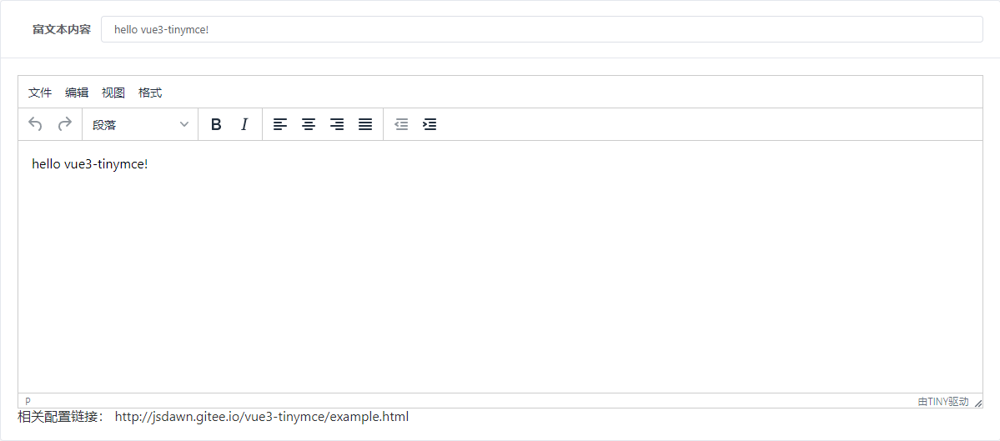
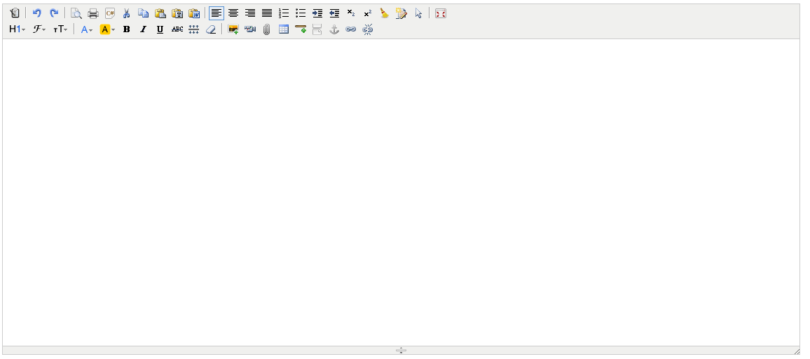
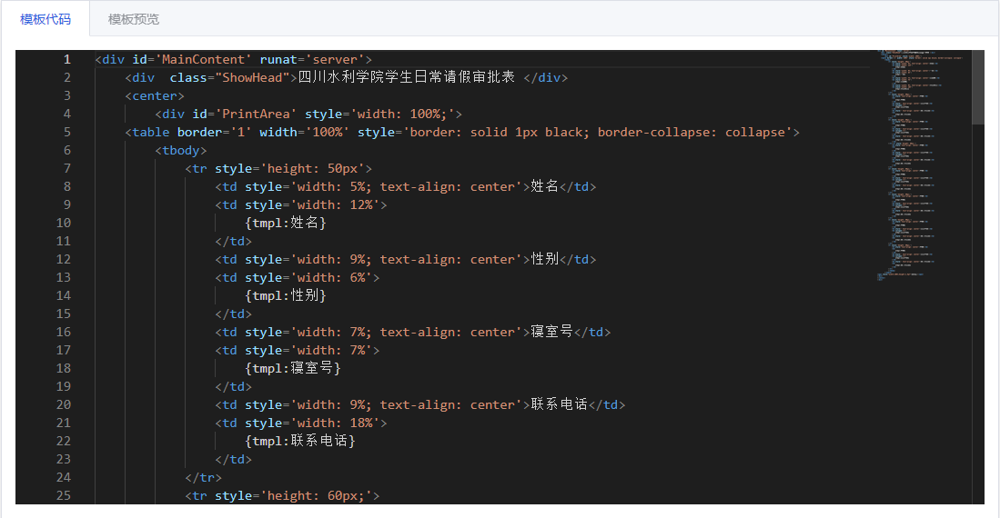

# 基础组件

::: tip 简介

基础组件的相关安装与配置
:::

<!-- ## 富文本编辑器
  项目的富文本编辑器使用的是vue3-tinymce
  ### 安装插件
  ```ts
  npm i @jsdawn/vue3-tinymce
  ```
  ### 代码引入
  ```ts
  // @ts-expect-error
  import Vue3Tinymce from '@jsdawn/vue3-tinymce';
  //富文本相关配置
  const state = reactive({
    content: 'hello vue3-tinymce!',//双向绑定的输入数据
    // editor 配置项
    setting: {
      height: 400, // editor 高度
      // 以中文简体为例
      language: 'zh_CN',
      language_url: 'https://unpkg.com/@jsdawn/vue3-tinymce@1.1.6/dist/tinymce/langs/zh_CN.js'
    }
  })
  //相关配置参考 http://jsdawn.gitee.io/vue3-tinymce/example.html
  ```
  ### 页面引入
  ```vue
  <vue3-tinymce v-model="state.content" :setting="state.setting" />
  ```
  ### 效果展示
   -->

## 富文本编辑器

项目的富文本编辑器使用的是 vue3-kind-editor, 主要考虑到兼容office办公软件

### 安装插件

```ts
npm i @zhj-target/vue3-kind-editor
```

::: tip 提示
vue3-kind-editor 在版本 0.1.2 之后，本地上传的图片是存的 base64
:::

### 代码引入

```ts
// @ts-expect-error
import Vue3KindEditor from '@zhj-target/vue3-kind-editor'
//富文本相关
const state = reactive({
  editorText: '',
})
```

### 页面引入

```vue
<vue3-kind-editor
  id="editor_id"
  height="500px"
  width="100%"
  v-model="state.editorText"
  :loadStyleMode="false"
></vue3-kind-editor>
```

### 效果展示



## 代码编辑器

项目的代码编辑器使用的是 monaco-editor，类似 vscode

### 安装插件

```ts
npm install monaco-editor@0.30.1
npm install monaco-editor-webpack-plugin@6.0.0
```

::: warning 注意
笔者尝试过几个版本，除了这两个搭配外，都出现了报错的情况
:::

### 重要配置

```js
// vue.config.js
const MonacoWebpackPlugin = require('monaco-editor-webpack-plugin')//----->此处配置
configureWebpack() {
  return {
    resolve: {
      alias: {
        '@': resolve('src'),
        '*': resolve(''),
        Assets: resolve('src/assets'),
      },
    },
    output: {
      library: `${name}-[name]`,
      libraryTarget: 'umd', // 把微应用打包成 umd 库格式
      jsonpFunction: `webpackJsonp_${name}`,
    },
    module: {
      rules: [
        {
          test: /\.(json5?|ya?ml)$/, // target json, json5, yaml and yml files
          loader: '@intlify/vue-i18n-loader',
          include: [
            // Use `Rule.include` to specify the files of locale messages to be pre-compiled
            path.resolve(__dirname, 'src/lang'),
          ],
        },
      ],
    },
    plugins: [
      new WebpackBar({
        name: title,
      }),
      new MonacoWebpackPlugin() //----->此处配置
    ],
  }
},
```

### 代码引入

```ts
// 引用组件
import * as monaco from 'monaco-editor'
//代码编辑的
const editorRef: any = ref(null)
const initEditor = () => {
  // 初始化编辑器，确保dom已经渲染
  editorRef.value = monaco.editor.create(document.getElementById('codeEditBox')!, {
    value: state.form.content, //编辑器初始显示文字--->state.form.content 这个是输入或者后端传过来的值
    language: 'html', //此处使用的python，其他语言支持自行查阅demo
    theme: 'vs-dark', //官方自带三种主题vs, hc-black, or vs-dark
    selectOnLineNumbers: true, //显示行号
    roundedSelection: false,
    readOnly: false, // 只读
    cursorStyle: 'line', //光标样式
    automaticLayout: true, //自动布局
    glyphMargin: true, //字形边缘
    useTabStops: false,
    fontSize: 15, //字体大小
    // autoIndent: true, //自动布局
    quickSuggestionsDelay: 100, //代码提示延时
  })
  // 监听值的变化
  editorRef.value.onDidChangeModelContent((val: any) => {
    console.log(val.changes[0].text)
    // state.form.content = val.changes[0].text;
    state.form.content = getVal()
  })
}
// 获得代码编辑器的值
const getVal = () => {
  return toRaw(editorRef.value).getValue() //获取编辑器中的文本------>toRaw是element-plus的方法
}
```

### 页面引入

```vue
<div id="codeEditBox"></div>
```

### 效果展示


